# Mikroservis Tabanli E-Ticaret Sistemi

**Kocaeli Universitesi — Teknoloji Fakultesi — Bilisim Sistemleri Muhendisligi**  
**Yazilim Gelistirme Laboratuvari II — Proje 1**

| | |
|---|---|
| **Proje Adi** | Mikroservis Tabanli E-Ticaret Sistemi |
| **Ekip Uyeleri** | Efekannnn (Gelistirici 1 — Dispatcher + Product Service), Kerem Unal (Gelistirici 2 — Auth + Order Service) |
| **Tarih** | Nisan 2026 |
| **Branch** | `integration` |

---

## 1. Giris

### Problem Tanimi

Modern e-ticaret sistemleri yuksek trafik, bagimsiz olcekleme ve surekli kullanilabilirlik gerektirir. Monolitik mimarilerde tek bir bilesendeki hata tum sistemi durdurabilir; yeni bir ozellik eklemek icin tum uygulamanin yeniden deploy edilmesi gerekir.

### Amac

Bu proje; bagimsiz olarak gelistirilebilen, deploy edilebilen ve olceklenebilen mikroservislerden olusan bir e-ticaret altyapisi kurmaktadir. Tum dis istekler merkezi bir **Dispatcher (API Gateway)** uzerinden yonetilir. Dispatcher biriminin gelistirilmesinde **TDD (Test-Driven Development)** disiplini uygulanmistir.

### Katkular

- Merkezi JWT dogrulama ve RBAC yetkilendirme
- IP bazli rate limiting (RATE_LIMIT_MAX ile yapilandirilabilir)
- Prometheus + Grafana ile gercek zamanli izleme
- Docker network izolasyonu ile guvenli servis mimarisi
- k6 ile smoke, load ve stress testleri

---

## 2. Sistem Mimarisi

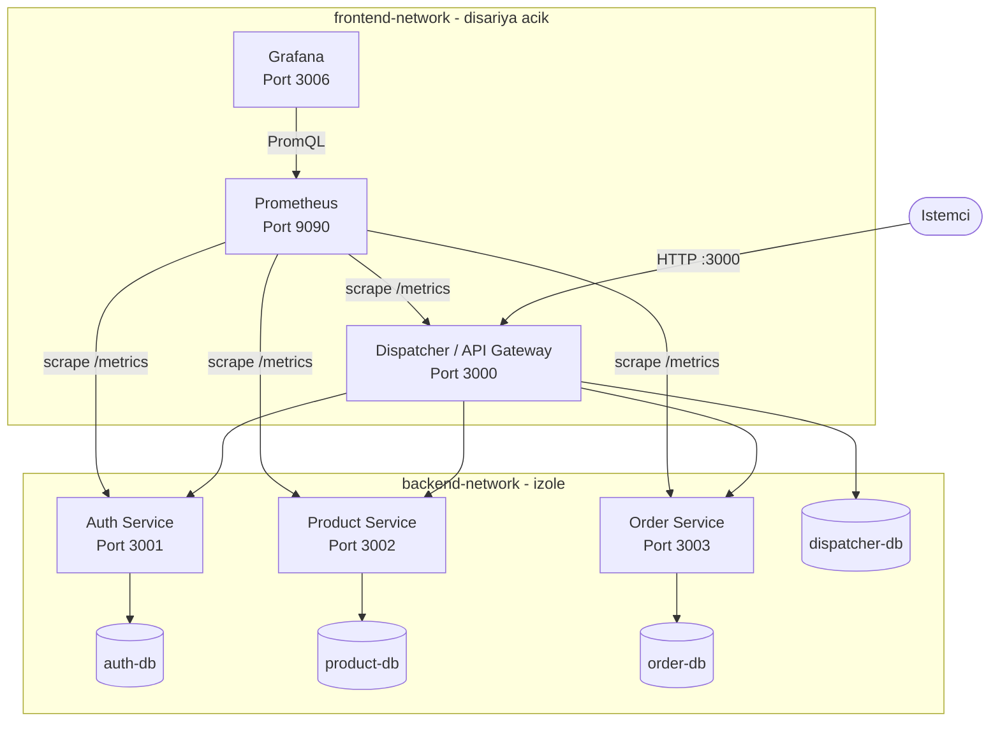
```mermaid
graph TB
    Client([Istemci])

    subgraph frontend["frontend-network - disariya acik"]
        Dispatcher["Dispatcher / API Gateway\nPort 3000"]
        Prometheus["Prometheus\nPort 9090"]
        Grafana["Grafana\nPort 3006"]
    end

    subgraph backend["backend-network - izole"]
        Dispatcher
        Prometheus
        AuthService["Auth Service\nPort 3001"]
        ProductService["Product Service\nPort 3002"]
        OrderService["Order Service\nPort 3003"]
        AuthDB[(auth-db)]
        ProductDB[(product-db)]
        OrderDB[(order-db)]
        DispatcherDB[(dispatcher-db)]
    end

    Client -->|HTTP :3000| Dispatcher
    Dispatcher --> AuthService
    Dispatcher --> ProductService
    Dispatcher --> OrderService
    Dispatcher --> DispatcherDB
    AuthService --> AuthDB
    ProductService --> ProductDB
    OrderService --> OrderDB
    Prometheus -->|scrape /metrics| Dispatcher
    Prometheus -->|scrape /metrics| AuthService
    Prometheus -->|scrape /metrics| ProductService
    Prometheus -->|scrape /metrics| OrderService
    Grafana -->|PromQL| Prometheus
```

### Servisler

| Servis | Port | Sorumluluk | Veritabani |
|---|---|---|---|
| Dispatcher | 3000 | API Gateway, JWT, Rate Limit, Proxy | dispatcher-db |
| Auth Service | 3001 | Kullanici kaydi, giris, token uretimi | auth-db |
| Product Service | 3002 | Urun CRUD islemleri | product-db |
| Order Service | 3003 | Siparis olusturma ve yonetimi | order-db |
| Prometheus | 9090 | Metrik toplama | - |
| Grafana | 3006 | Gorsellestirme | - |

---

## 3. Dispatcher (API Gateway) ve TDD

### 3.1 Middleware Zinciri

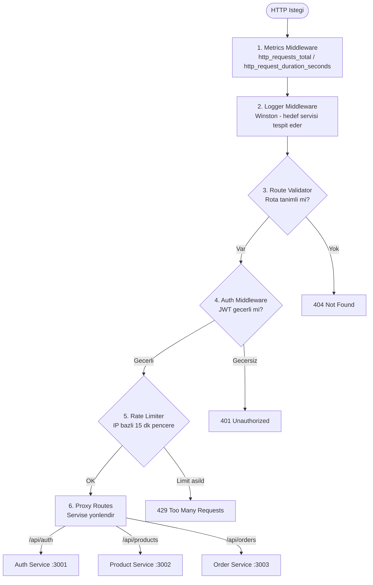
```mermaid
graph TD
    REQ([HTTP Istegi]) --> MW1
    MW1["1. Metrics Middleware\nhttp_requests_total / http_request_duration_seconds"]
    MW2["2. Logger Middleware\nWinston - hedef servisi tespit eder"]
    MW3{"3. Route Validator\nRota tanimli mi?"}
    MW4{"4. Auth Middleware\nJWT gecerli mi?"}
    MW5{"5. Rate Limiter\nIP bazli 15 dk pencere"}
    MW6["6. Proxy Routes\nServise yonlendir"]
    E404["404 Not Found"]
    E401["401 Unauthorized"]
    E429["429 Too Many Requests"]
    AS["Auth Service :3001"]
    PS["Product Service :3002"]
    OS["Order Service :3003"]

    MW1 --> MW2 --> MW3
    MW3 -->|Yok| E404
    MW3 -->|Var| MW4
    MW4 -->|Gecersiz| E401
    MW4 -->|Gecerli| MW5
    MW5 -->|Limit asild| E429
    MW5 -->|OK| MW6
    MW6 -->|/api/auth| AS
    MW6 -->|/api/products| PS
    MW6 -->|/api/orders| OS
```

### 3.2 JWT Yetkilendirme (RBAC)

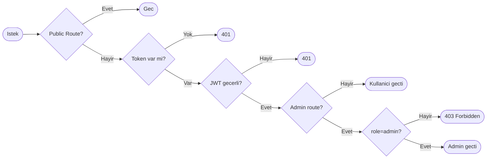
```mermaid
graph LR
    REQ([Istek]) --> PUB{Public Route?}
    PUB -->|Evet| PASS([Gec])
    PUB -->|Hayir| TOK{Token var mi?}
    TOK -->|Yok| E401([401])
    TOK -->|Var| VER{JWT gecerli?}
    VER -->|Hayir| E401B([401])
    VER -->|Evet| ADM{Admin route?}
    ADM -->|Hayir| OK([Kullanici gecti])
    ADM -->|Evet| ROLE{role=admin?}
    ROLE -->|Hayir| E403([403 Forbidden])
    ROLE -->|Evet| APASS([Admin gecti])
```

**Public Rotalar** (token gerekmez): `POST /api/auth/register`, `POST /api/auth/login`, `GET /api/health`, `GET /api/products`, `GET /api/products/:id`

**Admin Rotalar**: `POST /api/products`, `PUT /api/products/:id`, `DELETE /api/products/:id`, `DELETE /api/orders/:id`

### 3.3 Sinif Diyagrami

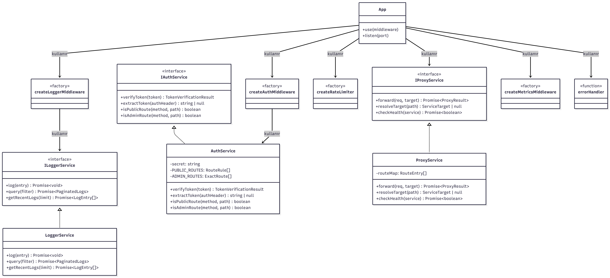

### 3.4 TDD Uygulamasi

Dispatcher **once testler yazilarak** gelistirildi (Red → Green → Refactor):

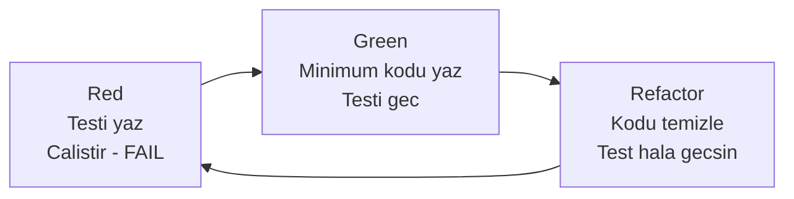
```mermaid
graph LR
    RED["Red\nTesti yaz\nCalistir - FAIL"] --> GREEN["Green\nMinimum kodu yaz\nTesti gec"]
    GREEN --> REF["Refactor\nKodu temizle\nTest hala gecsin"]
    REF --> RED
```

**Test Dosyalari:**

| Dosya | Kapsam |
|---|---|
| `auth.middleware.test.ts` | JWT dogrulama, public/admin rotalar |
| `rate-limiter.middleware.test.ts` | 429 limiti, pencere suresi |
| `proxy.service.test.ts` | Rota yonlendirme dogrulugu |
| `error-handler.middleware.test.ts` | 503, 500 hata yonetimi |
| `logger.service.test.ts` | Log kaydi ve seviyesi |
| `auth-flow.integration.test.ts` | Tam auth akisi |
| `proxy.integration.test.ts` | Proxy entegrasyon |

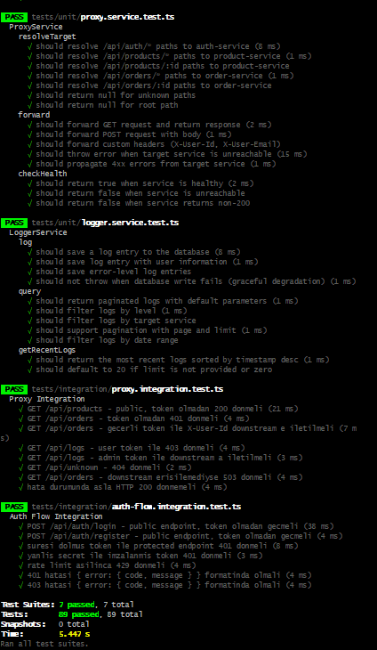

---

## 4. Mikroservisler

### 4.1 Auth Service

**Sorumluluk:** Kullanici kaydi, giris, JWT uretimi ve dogrulama.

.png)

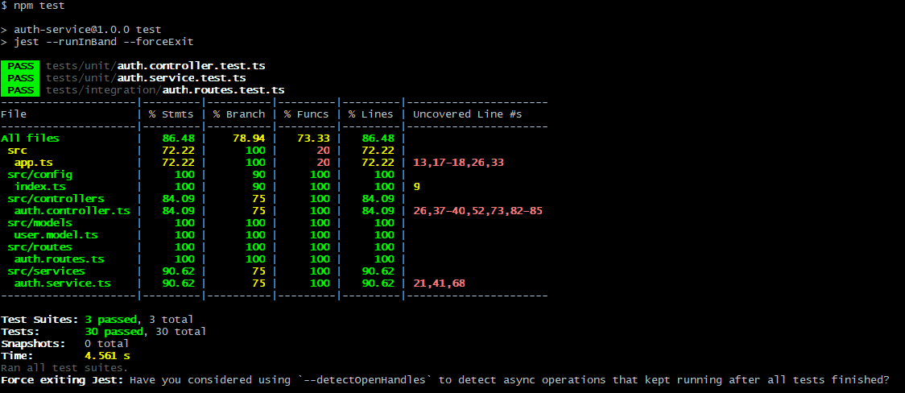

### 4.2 Product Service

**Sorumluluk:** Urun listeleme, ekleme, guncelleme, silme.

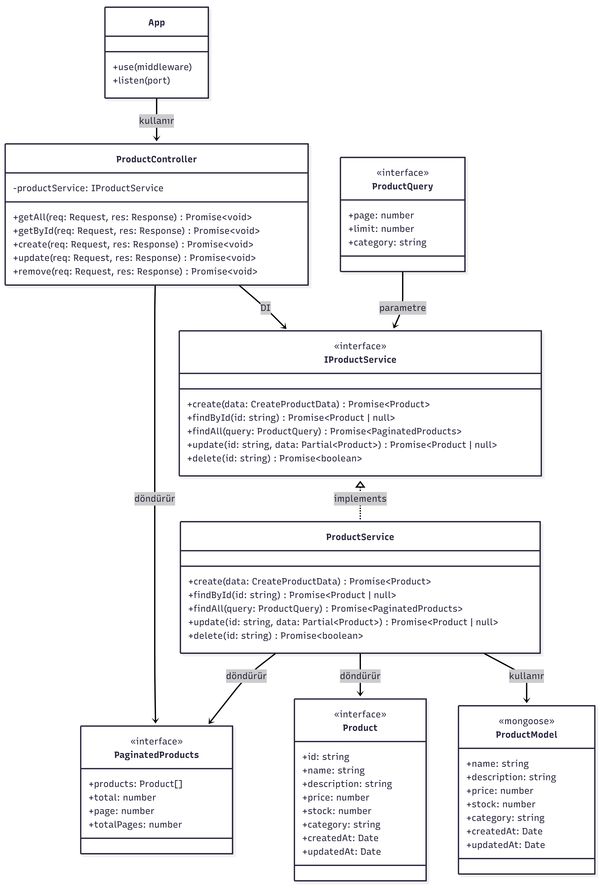

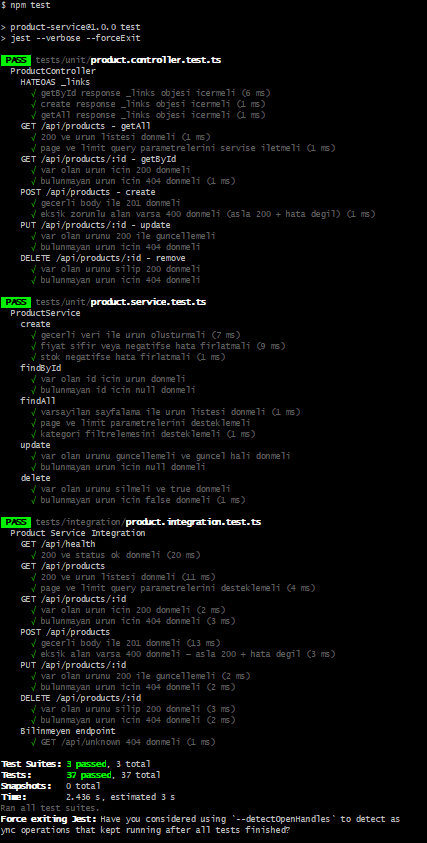

### 4.3 Order Service

**Sorumluluk:** Siparis olusturma, listeleme, durum guncelleme.

.png)

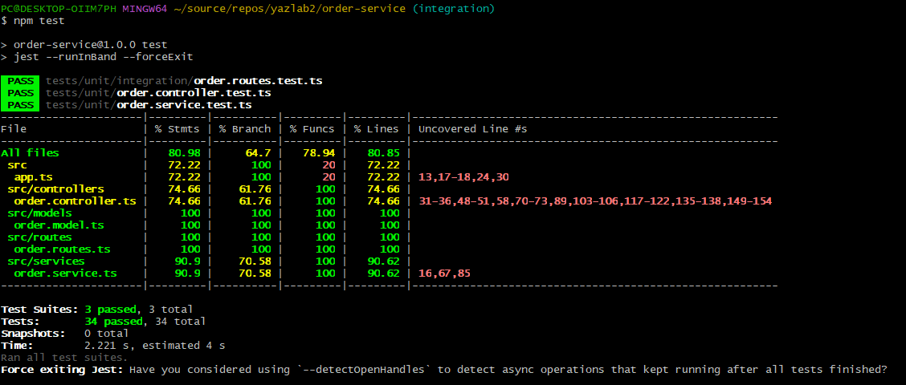

### 4.4 Tum Servis Test Ozeti

| Servis | Test Suites | Testler | Gecti | Kaldi | Kapsam |
|---|---|---|---|---|---|
| Dispatcher | 7 | 89 | 89 ✓ | 0 | - |
| Product Service | 3 | 37 | 37 ✓ | 0 | - |
| Auth Service | 3 | 30 | 30 ✓ | 0 | %86.48 |
| Order Service | 3 | - | - | 0 | - |
| **Toplam** | **16** | **156+** | **✓** | **0** | - |

---

## 5. RESTful API ve Richardson Olgunluk Modeli

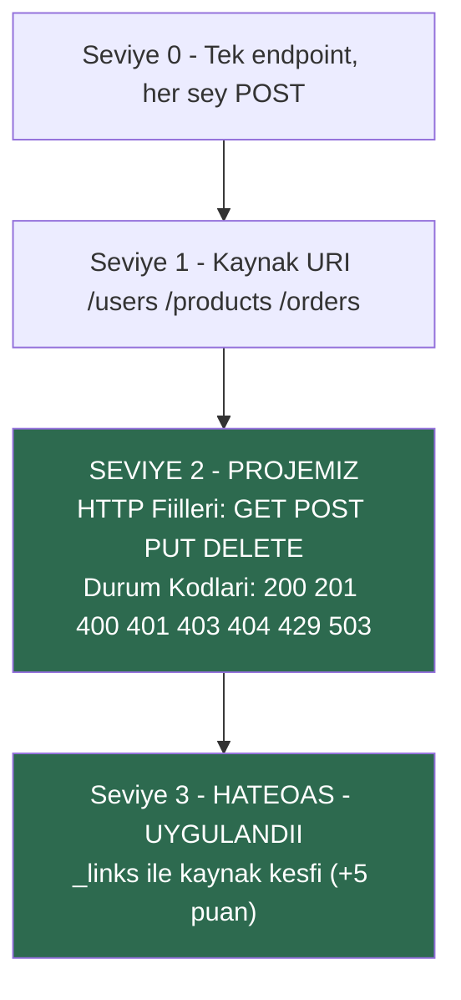
```mermaid
graph TD
    L0["Seviye 0 - Tek endpoint, her sey POST"]
    L1["Seviye 1 - Kaynak URI /users /products /orders"]
    L2["SEVIYE 2 - PROJEMIZ\nHTTP Fiilleri: GET POST PUT DELETE\nDurum Kodlari: 200 201 400 401 403 404 429 503"]
    L3["Seviye 3 - HATEOAS - UYGULANDII\n_links ile kaynak kesfi (+5 puan)"]

    L0 --> L1 --> L2 --> L3
    style L2 fill:#2d6a4f,color:#fff
    style L3 fill:#2d6a4f,color:#fff
```

### API Endpointleri

**Auth** (`/api/auth`)

| Method | Endpoint | Auth | Aciklama |
|---|---|---|---|
| POST | /register | - | Kullanici olustur, token don |
| POST | /login | - | Giris yap, token don |

**Products** (`/api/products`)

| Method | Endpoint | Auth | Aciklama |
|---|---|---|---|
| GET | / | - | Urun listesi |
| GET | /:id | - | Urun detayi |
| POST | / | User | Urun ekle |
| PUT | /:id | User | Urun guncelle |
| DELETE | /:id | User | Urun sil |

**Orders** (`/api/orders`)

| Method | Endpoint | Auth | Aciklama |
|---|---|---|---|
| GET | / | User | Siparis listesi |
| GET | /:id | User | Siparis detayi |
| POST | / | User | Siparis olustur |
| PUT | /:id | User | Durum guncelle |
| DELETE | /:id | Admin | Siparis sil |

---

## 6. Sequence Diyagramlari

### Kayit ve Giris Akisi

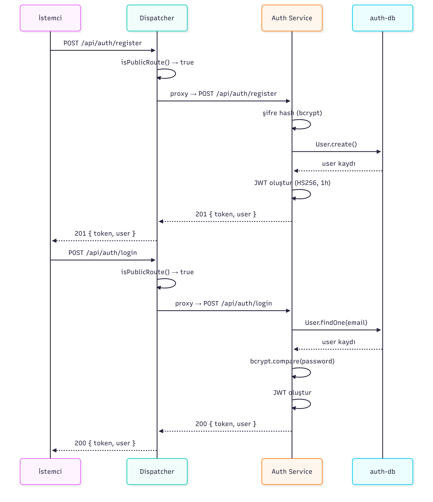

### Siparis Akisi

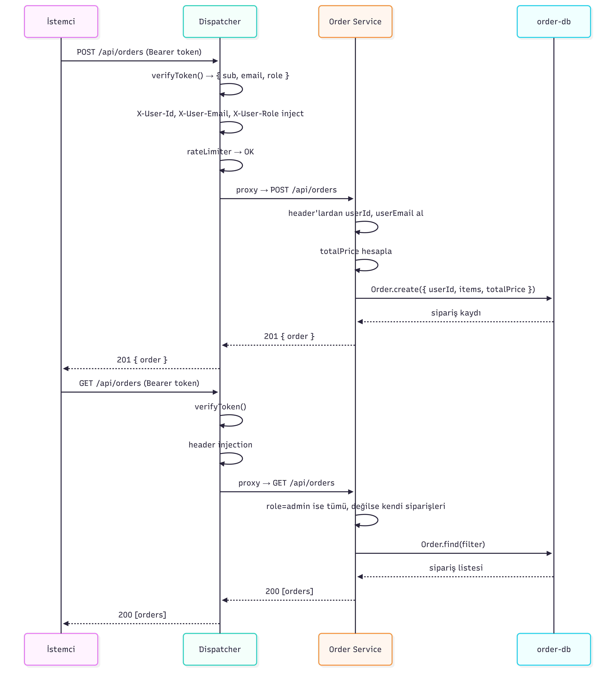

### Urun CRUD Akisi

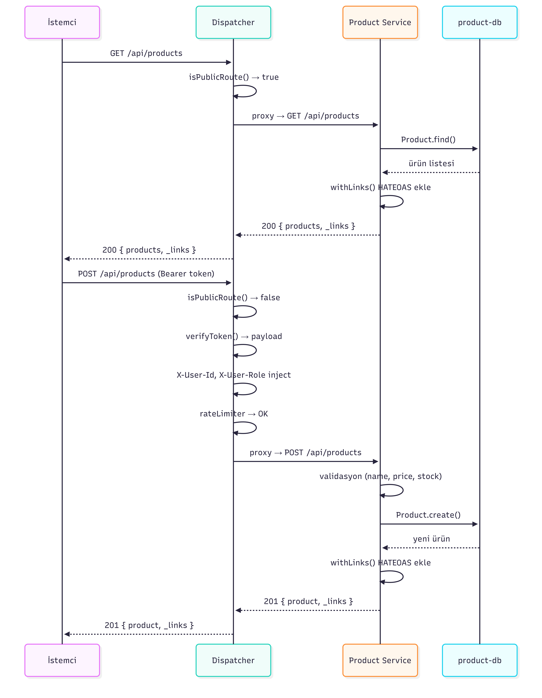

### Hata Durumu Akisi

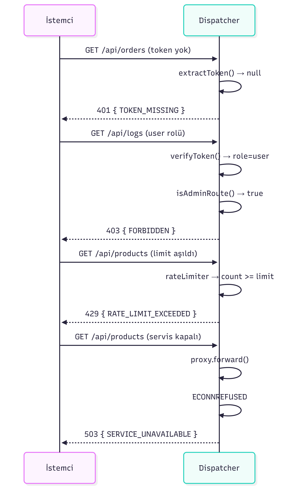

---

## 7. Veritabani (ER Diyagrami)

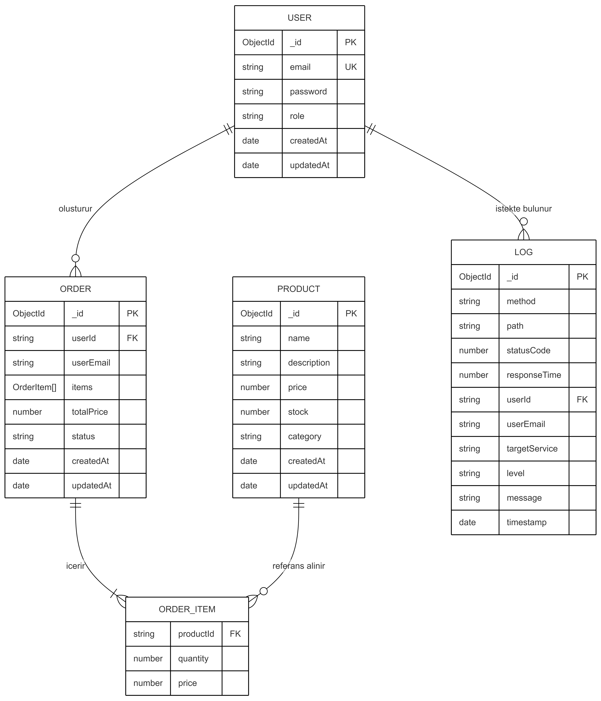

**Her servisin veritabani tamamen izoledir:**

| Servis | Veritabani | Koleksiyon |
|---|---|---|
| Dispatcher | dispatcher-db | logs |
| Auth Service | auth-db | users |
| Product Service | product-db | products |
| Order Service | order-db | orders |

---

## 8. OOP ve SOLID Prensipleri

| Prensip | Uygulama |
|---|---|
| **S** — Tek Sorumluluk | Auth yalnizca kimlik, Order yalnizca siparis, Product yalnizca urun yonetir |
| **O** — Acik/Kapali | Yeni servis eklemek mevcut middleware'i degistirmez |
| **L** — Liskov | `IAuthService`, `IOrderService`, `IProductService` arayuzleri implementasyonla degistirilebilir |
| **I** — Arayuz Ayirimi | Her servis yalnizca kendi minimal arayuzune baglidir |
| **D** — Bagimlilik Tersine Cevirme | Servis URL'leri env'den okunur, hard-code yoktur |

---

## 9. Docker ve Sistem Orkestrasyonu

### Multi-Stage Build

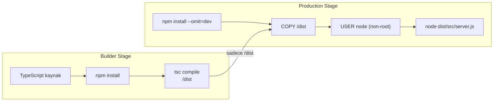
```mermaid
graph LR
    subgraph builder["Builder Stage"]
        SRC["TypeScript kaynak"] --> NPM1["npm install"]
        NPM1 --> TSC["tsc compile\n/dist"]
    end
    subgraph production["Production Stage"]
        NPM2["npm install --omit=dev"]
        DIST["COPY /dist"]
        USR["USER node (non-root)"]
        CMD["node dist/src/server.js"]
        NPM2 --> DIST --> USR --> CMD
    end
    TSC -->|sadece /dist| DIST
```

```bash
# Tum sistemi tek komutla ayaga kaldir
docker compose up --build -d
```

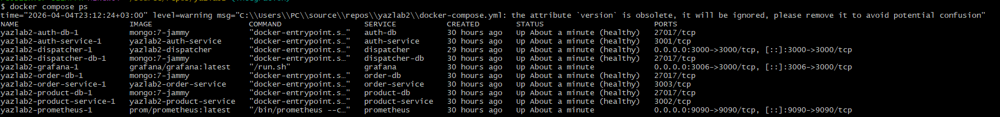

### Ag Izolasyonu

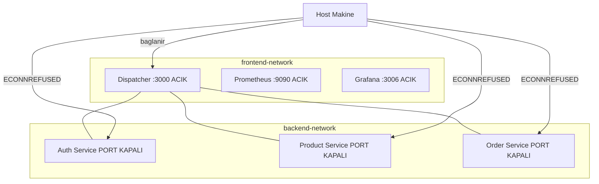
```mermaid
graph TB
    HOST["Host Makine"]
    subgraph fn["frontend-network"]
        D["Dispatcher :3000 ACIK"]
        PR["Prometheus :9090 ACIK"]
        GR["Grafana :3006 ACIK"]
    end
    subgraph bn["backend-network"]
        AS["Auth Service PORT KAPALI"]
        PS["Product Service PORT KAPALI"]
        OS["Order Service PORT KAPALI"]
    end
    D --- AS
    D --- PS
    D --- OS
    HOST -->|baglanir| D
    HOST -->|ECONNREFUSED| AS
    HOST -->|ECONNREFUSED| PS
    HOST -->|ECONNREFUSED| OS
```

Auth, Product ve Order servisleri `ports:` tanimi olmadigi icin host makineden **dogrudan erisilemez**. Yalnizca Dispatcher uzerinden ulasılabilir.

---

## 10. Izleme — Prometheus & Grafana

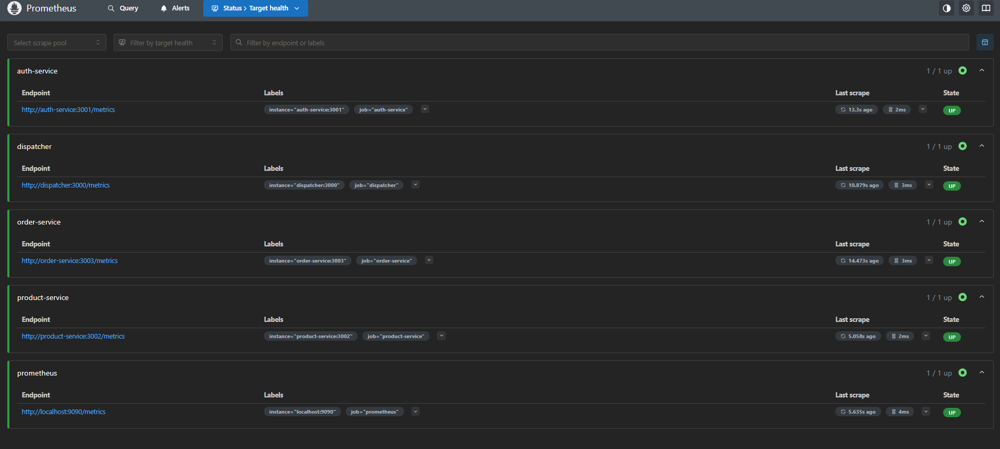

### Toplanan Metrikler

| Metrik | Tip | Aciklama |
|---|---|---|
| `http_requests_total` | Counter | Toplam HTTP istegi (method/route/status_code) |
| `http_request_duration_seconds` | Histogram | Yakit suresi — p50/p95/p99 |
| `dispatcher_nodejs_heap_size_used_bytes` | Gauge | Node.js heap bellek |
| `dispatcher_process_cpu_seconds_total` | Counter | CPU kullanimi |

Prometheus her **15 saniyede** tum servislerin `/metrics` endpoint'ini ceker.  
Grafana bu verileri gorsellestirir: `http://localhost:3006`

---

## 11. Yuk Testleri (k6)

### Test Senaryolari

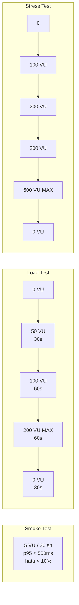
```mermaid
graph LR
    subgraph smoke["Smoke Test"]
        S["5 VU / 30 sn\np95 < 500ms\nhata < 10%"]
    end
    subgraph load["Load Test"]
        L1["0 VU"] --> L2["50 VU\n30s"]
        L2 --> L3["100 VU\n60s"]
        L3 --> L4["200 VU MAX\n60s"]
        L4 --> L5["0 VU\n30s"]
    end
    subgraph stress["Stress Test"]
        ST1["0"] --> ST2["100 VU"]
        ST2 --> ST3["200 VU"]
        ST3 --> ST4["300 VU"]
        ST4 --> ST5["500 VU MAX"]
        ST5 --> ST6["0 VU"]
    end
```

---

### Smoke Test Sonuclari

> 5 sanal kullanici, 30 saniye — temel calisabilirlik dogrulamasi

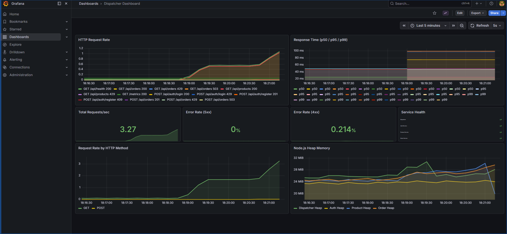

| Metrik | Deger | Esik | Sonuc |
|---|---|---|---|
| Toplam Istek | 452 | - | - |
| Istek/saniye | 14.78 req/s | - | - |
| Ortalama Yanit | 5.37 ms | - | - |
| p95 Yanit Suresi | **12.03 ms** | < 500 ms | **GECTI** |
| Hata Orani | **0.22%** | < 10% | **GECTI** |
| Health Check | 150/150 | - | **GECTI** |
| Products 200 | 150/150 | - | **GECTI** |
| Orders 200 | 150/150 | - | **GECTI** |

---

### Load Test Sonuclari

> 0 → 200 sanal kullanici, ~3.5 dakika — normal yuk altinda performans

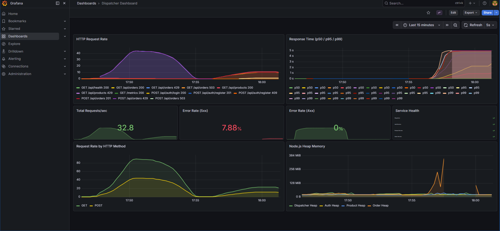

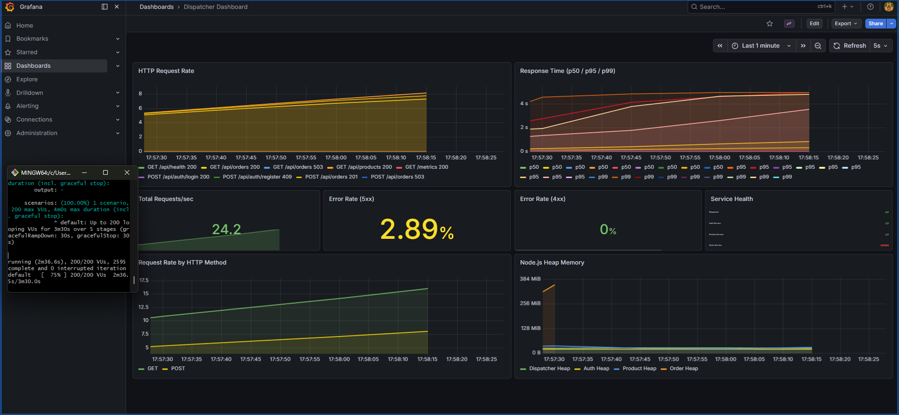

| Metrik | Deger | Esik | Sonuc |
|---|---|---|---|
| Toplam Istek | 9,980 | - | - |
| Istek/saniye | 46.47 req/s | - | - |
| Ortalama Yanit | 1,945 ms | - | - |
| p95 Yanit Suresi | **10,002 ms** | < 1,000 ms | **KALDI** |
| Hata Orani | **7.31%** | < 5% | **KALDI** |
| Products 200 | 3,326/3,326 | - | **GECTI** |
| Order Olustur 201 | 3,006/3,326 (320 hata) | - | Kismi |
| Orders Listele 200 | 2,917/3,326 (409 hata) | - | Kismi |

> **Not:** Hatalar veritabaninda birikmis veri ve siparis sorgularindaki pagination eksikliginden kaynaklanmistir. `OrderModel.find().limit(50)` ile duzeltilmistir.

---

### Stress Test Sonuclari

> 0 → 500 sanal kullanici, ~4 dakika — sistemin sinir noktasini bulmak

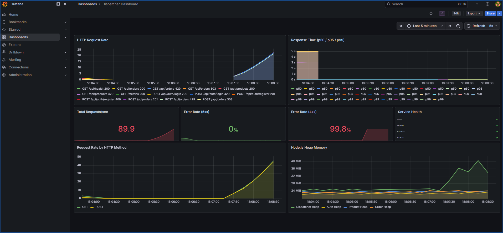

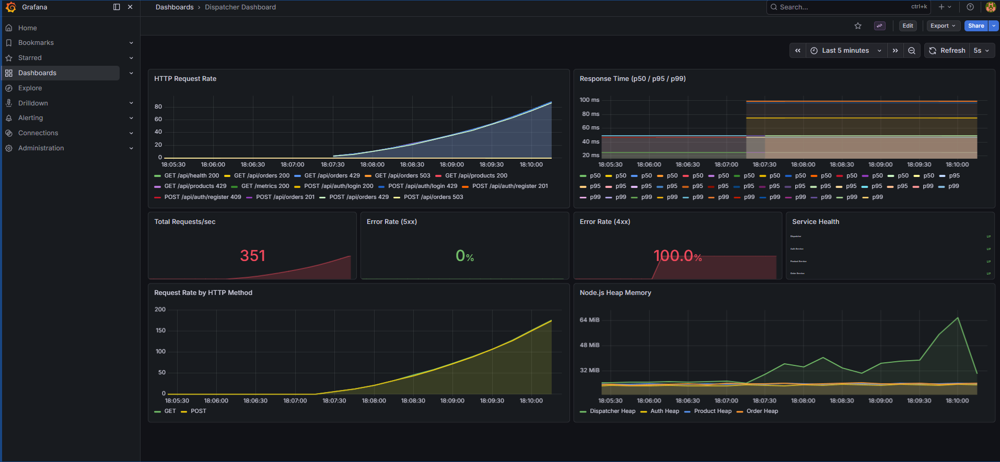

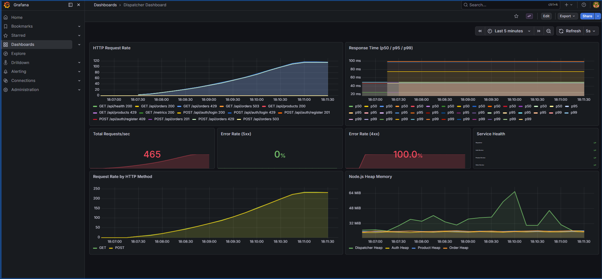

| Metrik | Deger | Esik | Sonuc |
|---|---|---|---|
| Toplam Istek | 131,879 | - | - |
| Istek/saniye | 548.52 req/s | - | - |
| Ortalama Yanit | 11.94 ms | - | - |
| p95 Yanit Suresi | **64.17 ms** | < 2,000 ms | **GECTI** |
| Hata Orani | **~99.9%** | < 10% | **KALDI** |

> **Not:** 500 es zamanli kullanicida rate limiter devreye girerek isteklerin buyuk cogunlugunu reddetti. Sunucuya ulasan isteklerin yanit suresi (64ms p95) kabul edilebilir duzeydi; sorun istek hacminin rate limit sinirini cok asmasi.

---

### Test Karsilastirma Tablosu

| Test | Max VU | Sure | p95 Yanit | Hata Orani | Sonuc |
|---|---|---|---|---|---|
| **Smoke** | 5 | 30 sn | 12 ms | %0.22 | **BASARILI** |
| **Load** | 200 | ~3.5 dk | 10,002 ms | %7.3 | **KISMI** |
| **Stress** | 500 | ~4 dk | 64 ms | ~%100 | **SINIR ASILD** |

---

## 12. Basarilar, Sinirliliklar ve Gelistirmeler

### Basarilar

- Docker ile tek komutta tam sistem kurulumu (`docker compose up --build -d`)
- Dispatcher TDD ile gelistirildi, 7 birim + 2 entegrasyon testi
- JWT + RBAC merkezi yetkilendirme sistemi calisir durumda
- Prometheus metrikleri her servisten basariyla toplaniyor
- Smoke test %100 basari ile tamamlandi

### Sinirliliklar

- Load testinde DB pagination eksikligi hata oranini artirdi (duzeltildi: `.limit(50)`)
- Stress testinde rate limiter 500 VU icin yetersiz kaldi (RATE_LIMIT_MAX arttirilabilir)
- Order servisinde items alani DB'de gomulu saklandigi icin cross-servis JOIN sorgusu yapilamiyor

### Olasi Gelistirmeler

- Redis ile dagitik rate limiting (cok instance senaryosu icin)
- Swagger/OpenAPI dokumantasyonu
- CI/CD pipeline (GitHub Actions)
- Horizontal scaling — birden fazla Order Service instance

---

## Kurulum

```bash
# 1. Repo'yu klonla
git clone <repo-url>
cd yazlab2

# 2. Ortam degiskenlerini ayarla
cp .env.example .env
# .env icinde JWT_SECRET degerini guncelle

# 3. Tum servisleri basalt
docker compose up --build -d

# 4. Saglik kontrolu
curl http://localhost:3000/api/health

# 5. Yuk testleri
k6 run load-tests/scripts/smoke-test.js
k6 run load-tests/scripts/load-test.js
k6 run load-tests/scripts/stress-test.js
```

### Servis URL'leri

| Servis | URL |
|---|---|
| API Gateway | http://localhost:3000 |
| Prometheus | http://localhost:9090 |
| Grafana | http://localhost:3006 (admin/admin) |
